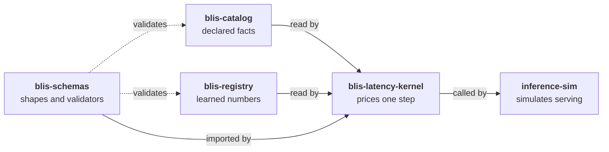

---
hide:
  - navigation
---

# blis-registry

The registry holds the learned numbers behind a [BLIS](https://inference-sim.github.io/inference-sim/)
latency estimate: the coefficients a cost model fits from measurements or, where no
measurement exists, assumes. Each coefficient records how it was obtained and which
hardware it applies to, so an estimate can be traced back to the evidence it rests on.

At revision <!-- registry:ref -->, the registry holds <!-- registry:stat total -->
coefficient entries in <!-- registry:stat sets --> sets, covering
<!-- registry:stat parts --> GPU parts. By method: <!-- registry:stat measured -->
`measured`, <!-- registry:stat vendor_spec --> `vendor_spec` (transcribed from NVIDIA's
AISimulate), <!-- registry:stat assumed --> `assumed`, and
<!-- registry:stat not_charged --> `not_charged` (a declared zero).

## Where it sits

BLIS keeps different kinds of number in different repositories. The registry holds
one kind: numbers that a measurement could revise.

[How the five repositories divide the work](concepts/index.md) explains the split and
why it is drawn where it is.

## Where to start

**To run BLIS with the registry, or read it from your own code**, read
[Using](using/index.md). You need a clone at a release tag and its path.

**To add a part, refit a family or correct an entry**, read
[Contributing](contributing/index.md). Most sets are written by scripts, and the page
explains which checks run where.

**To understand what a coefficient is and why the registry is shaped the way it is**,
read [Concepts](concepts/index.md). Three short pages.

**To look up a value**, go to [Reference](reference/index.md). Every table there is
generated from the committed files, and every value links to its entry.

**To challenge a value**, read [Methodology](research/index.md): the rules, the evidence
behind each decision, and the claims later withdrawn.

## One coefficient

Every entry looks like this one, quoted from the committed file when this page was built:

<!-- registry:entry cost-model-primitives gemm_m_half_bf16 a100-sxm -->

It is a measured, fitted constant of the GEMM efficiency ramp, scoped to two names for
the same A100 silicon, citing the exact sweep it was fitted on. The
[Coefficients](concepts/coefficients.md) page explains each field.
